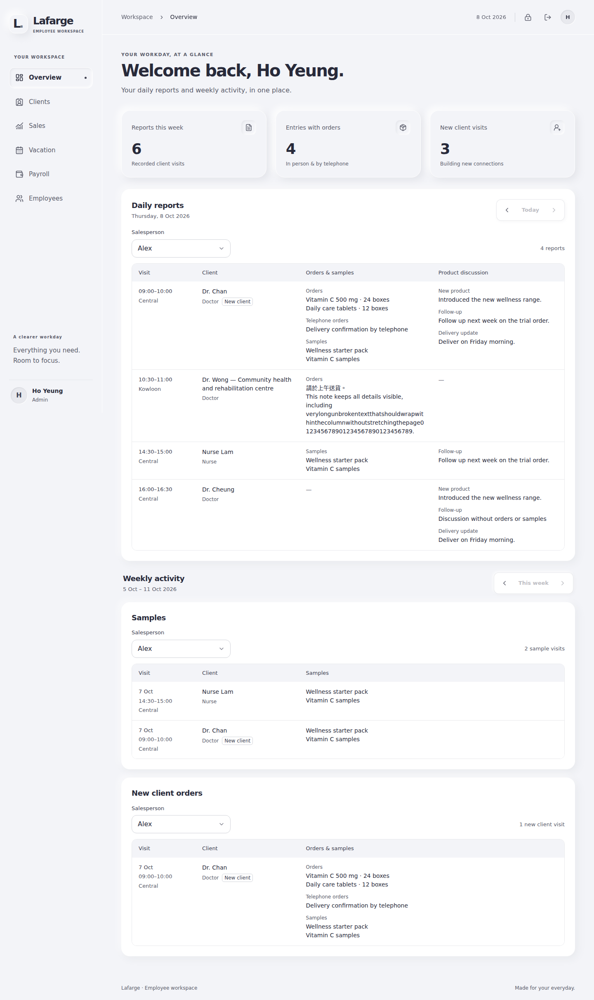

# Light workspace redesign

A single grayscale design across the React employee workspace and Django administration. The supplied `#F3F4F8`–`#101223` palette is used for the canvas, text, controls, and restrained neumorphic shadows.

## Screens

All screenshots use synthetic review data.

- [Overview](ui/overview.png)
- [Report editor on desktop](ui/report-desktop.png)
- [Report editor on a phone](ui/report-mobile.png)
- [Sign in](ui/sign-in.png)
- [Django administration](ui/admin.png)

## What changed

- Sidebar and mobile navigation drawer for the workspace; Reports restores full-width top navigation. Navigation shares the same role permissions, preload behavior, pressed active states and skip link. The drawer retains focus containment, Escape dismissal and focus restoration.
- New overview, sign-in, settings and report-entry layouts. Clients, sales, vacation, employees, payroll and access/error states share the same palette, typography, spacing and controls.
- Reports uses an Excel-style grid with one row per entry, faint row/column dividers and white editing cells and Delete buttons against a light gray table. A near-white page, lighter labels, soft neumorphic depth and a compact inset date control give the editor a clean hierarchy. Inputs have subtle inset edges; a dark outline marks the active cell, and hover/focus highlights its row. Desktop rows are 37px tall; the fixture shows 17 complete entries at 1440 × 900 and 13 at 1366 × 768, with all columns visible. Compact status text and the short toolbar autosave indicator retain full accessible labels and hover descriptions. Individual Save buttons are removed; one always-available Save All stays at the bottom beside Add New Entry, outside the scrolling table. A single sticky header and horizontal scrolling keep all fields in one row on narrow screens; touch inputs remain 44px tall. Long text expands only while editing, then returns to a single-line preview. Stable row identity, background autosave and draft recovery remain intact.
- Suggestions support arrows, Enter and Escape, without interfering with Chinese input composition. Report suggestions float above the scrolling table and open upward when needed, so the last row is usable. Ordinary arrows keep their normal editing behavior; Alt+Arrow navigates report rows.
- Compact loading indicators, static save feedback, light notifications and short press/focus transitions. Report notifications appear in a bounded stack at the upper right so failed-save messages cannot cover the bottom Save All button. Reduced-motion preferences are honored. No animation library or runtime dependency was added.
- Vacation starts with one clearly labeled blank date, followed by signature and submission. Payroll and employee edits have associated labels. Dense dashboard tables retain mobile card views and keyboard-scrollable desktop regions.
- Matching Django administration theme through a small template override and static stylesheet. Native admin forms and permission checks remain in place.

## Verification

- 45 frontend tests passed, including report save/cache/recovery regressions and keyboard/composition checks. Save workflows use the single bottom Save All button.
- Production TypeScript/Vite build and lint of changed frontend components, pages, design files and hooks passed.
- Django system checks passed; report suite: 14 passed and 1 PostgreSQL-only concurrency test skipped in local SQLite.
- Chromium smoke checks used isolated API fixtures across desktop (1440px), phone (390px), narrow phone (320px) and landscape (844px) layouts. No page-level horizontal overflow or uncaught React errors in the checked screens, including expanded sales, payroll editing and employee editing.
- A slow report write retained the enabled Save All button, showed local-save/sync status immediately, then confirmed Saved without duplicating the write.
- Automated axe WCAG A/AA scans found no violations in the 15 tested route/interaction states. This is an automated check, not a claim of complete accessibility certification.
- Native mobile dialog focus containment/restoration, password visibility and reduced-motion behavior passed browser checks.
- The report grid was checked at 1440 × 900, 1366 × 768, 1920 × 1080, 844 × 900, 390 × 844, 320 × 800 and 844 × 390. All inputs stay in one table row, one heading row remains sticky, and horizontal overflow is contained in the table. Seven layout and three report interaction/empty/error states passed axe scans after entrance animations settled, with no violations. Long-text expansion/collapse, bottom-row suggestions, keyboard scrolling, native checkbox/select keyboard input, navigation between report/sidebar layouts and slow/failed save/retry behavior passed. Repeated failures across four rows leave Save All clickable on desktop and phone. The compact landscape navbar keeps the 844 × 390 view within the screen height.
- Django admin dashboard, user list, change form and login rendered from an isolated test database and were checked at desktop/phone widths; no page overflow or JavaScript errors.

## Release

The frontend includes the report autosave work; retain those backend/API changes when deploying. Build and deploy the React frontend as usual. Deploy the Django template/static files, run `python manage.py collectstatic --noinput`, and restart the backend to apply the template directory setting. No new database migration is introduced by the visual redesign.

Implementation guidelines and the complete palette are in [the design system guide](../frontend/employee/src/design-system/README.md).
